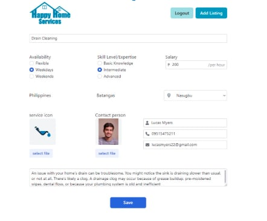

🏠 HappyHome_Services
A comprehensive marketplace platform for home services, built with performance and scalability in mind using the Next.js App Router.

🚀 Tech Stack
Framework: Next.js 15 (App Router)

Styling: Tailwind CSS

Authentication: WorkOS (Enterprise-ready auth)

Database (Text): MongoDB via Mongoose

Storage (Images): AWS S3

Deployment: Vercel

📸 Interface Preview
<table style="width: 100%; border-collapse: collapse;"> <tr> <td align="center" width="50%"> <b>Landing Page</b>   </td> <td align="center" width="50%"> <b>Login (WorkOS)</b>   </td> </tr> <tr> <td align="center" width="50%"> <b>Service Listings</b>   </td> <td align="center" width="50%"> <b>Create New Listing</b>   </td> </tr> <tr> <td align="center" width="50%"> <b>Edit Listing</b>   </td> <td align="center" width="50%"> <b>Management Dashboard</b>   </td> </tr> </table>

🛠️ Features & Integration
Secure Auth: Managed identity via WorkOS for seamless login flows.

Dynamic Storage: User-uploaded images are processed and stored in AWS S3 buckets for high availability.

Flexible Data: MongoDB handles complex service listing schemas and user metadata.

Responsive Design: Fully optimized for mobile and desktop using Tailwind CSS.

⚙️ Getting Started
1. Prerequisites
Ensure you have your environment variables set up in a .env.local file:

Code snippet

WORKOS_API_KEY=
WORKOS_CLIENT_ID=
MONGODB_URI=
AWS_S3_ACCESS_KEY=
AWS_S3_SECRET_ACCESS_KEY=
2. Installation & Development
Bash

# Install dependencies
npm install

# Start the dev server
npm run dev
Open http://localhost:3000 to view the app.

🚢 Deployment
This app is optimized for Vercel. Simply connect your GitHub repository, add your Environment Variables, and deploy.
